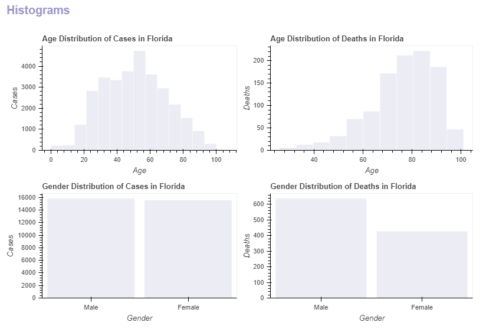

## Interactive COVID-19 App

### URL

[hbap-analytics.com](https://hbap-analytics.com)

### Maps

---

Map section is an interactive US map showing COVID-19 cases by US County.


### Trends

---

Trends section includes interactive line graphs showing COVID-19 cases and deaths by State. In addition, it shows predicted cases and deaths for the next 15 days based on previous data for each State. You can select one or multiple States from the selection list on the left to compare trends.


### Histograms

---

Histograms section is based on data released by the State of Florida Division of Emergency Management. It explores distributions of COVID-19 cases and deaths in different age and gender groups.



### Models

---

Models section explores Florida COVID-19 death correlation with age, county density population, county land area, county water area, and county population using multiple classification models.


### Running App Locally

1. Clone or download source files

2. Install the geopandas python package. Using *pip install geopandas* will likely require intense user interaction as some geopandas dependencies (e.g., Fiona) require GDAL. If you have the Anaconda distribution installed, install geopandas from the **Anaconda PowerShell Prompt**:

``` Anaconda
conda install -c conda-forge geopandas
```

3. From the *covid-master* directory, install required Python packages:

``` python
pip install -r requirements.txt
```

4. From the *app* directory, run app:

``` python
bokeh serve --show covid
```

If everything goes well, it will open the COVID-19 page.


### Data Sources

* [New York Times](https://www.nytimes.com/)
* [Florida Division of Emergency Management](https://floridadisaster.org/covid19/)
* [US Census Bureau](https://www.census.gov/)

### Technologies

* AI and ML
* AJAX
* Bokeh
* Flask (work-in-progesss)
* HTML
* GIS
* JavaScript
* Python
* Python Packages
* SQLite
