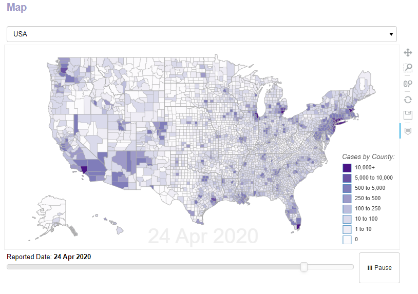
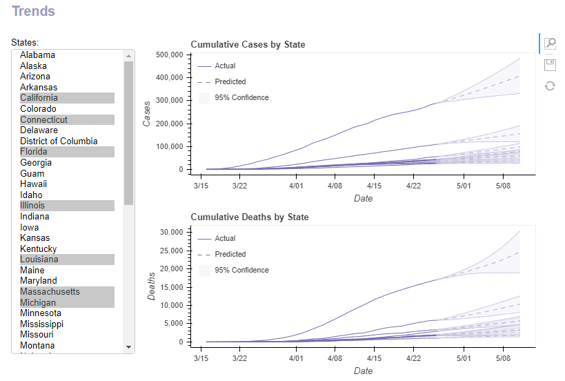
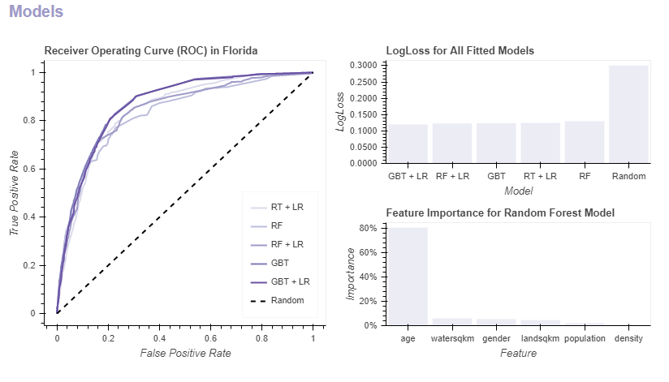

### Access Live
[https://hbap-analytics.com](https://hbap-analytics.com)

### Maps

---

Map section is an interactive US map showing COVID19 cases by US County.

### Trends

---

Trends section include interactive line graphs showing COVID19 cases and deaths by State. In addition, it is showing predicted cases and deaths for the next 15 days based on previous trends for each State. You can select one or multiple States from a selection list on the left.

### Histograms

---

Histograms section is based on data released by the State of Florida Division of Emergency Management. It explores distributions of COVID19 in different age groups and gender.

### Models

---

Models section explores COVID19 deaths correlation with age, and density population in Florida using multiple classification models.

### Data Sources

* [New York Times](https://www.nytimes.com/)
* [Florida Division of Emergency Management](https://floridadisaster.org/covid19/)

### Technologies

* Python
* Bokeh
* HTML
* JavaScript
* AJAX
* AI and ML
