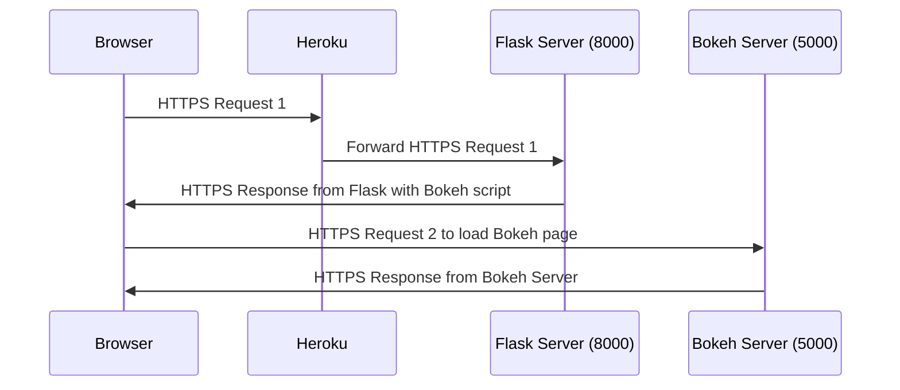
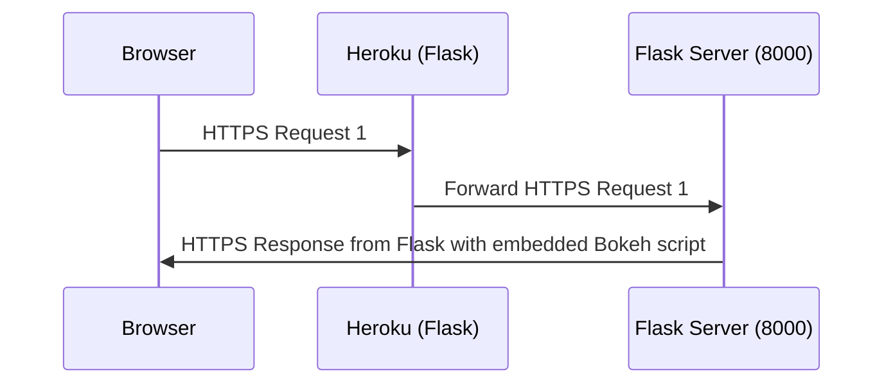
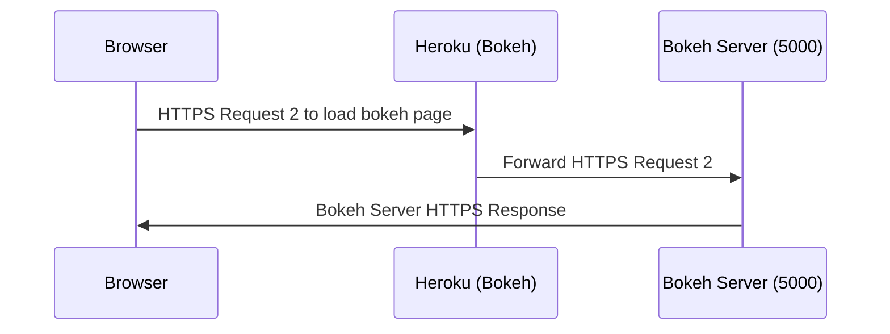
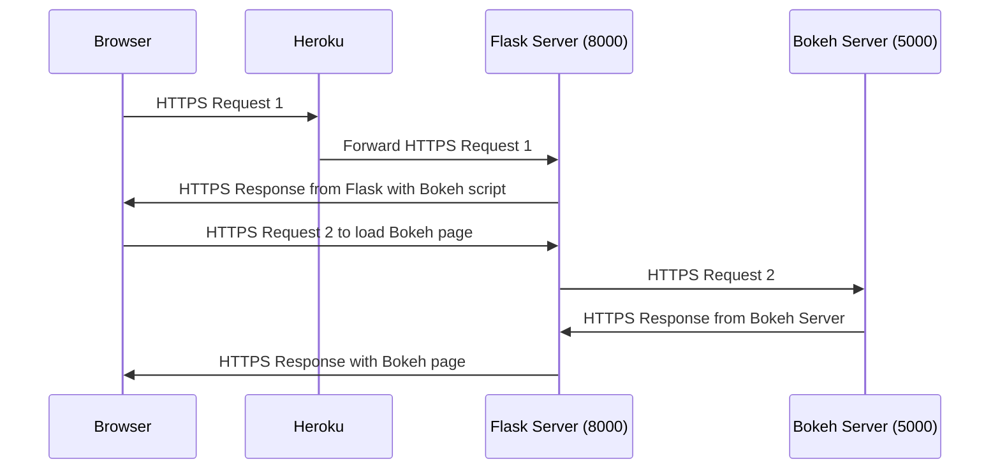

# Deploying a Flask + Bokeh Server App in Heroku

### Similar architecture is used in the flask_gunicorn_embed.py but it won't in heroku within one heroku app.

### it may be possible to setup two heroku apps to simulate the architecture of the example.

### Another alternative is having Flask as a reverse-proxy for the Bokeh Server.

